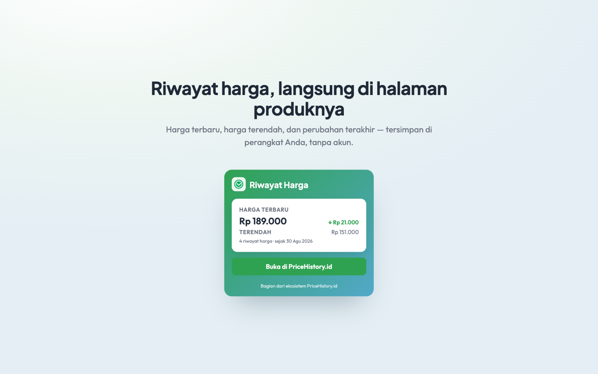
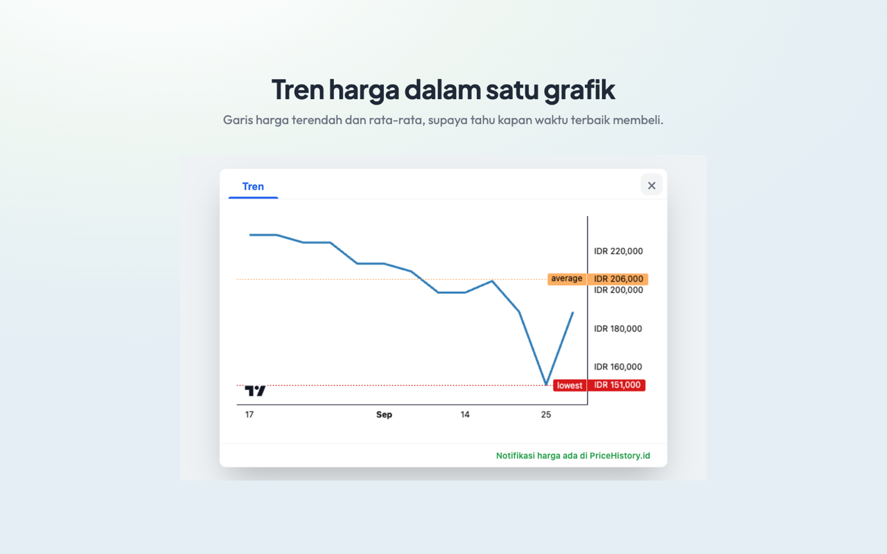

# Price History ID

<div align="center">


**E-commerce Price Tracker Extension**

  <a href="https://github.com/pricehistoryid/chrome-price-history/blob/main/LICENSE">
    
  </a>
  <a href="https://github.com/pricehistoryid/chrome-price-history/releases/latest">
    
  </a>
  <a href="https://github.com/pricehistoryid/chrome-price-history/stargazers">
    
  </a>
  <a href="https://github.com/sponsors/wikankun">
    
  </a>
  <a href="https://github.com/pricehistoryid/chrome-price-history/releases">
    
  </a>
  <a href="https://github.com/pricehistoryid/chrome-price-history/graphs/contributors">
    
  </a>


</div>

---

A browser extension for tracking price history on Indonesian online marketplaces. It tracks **Tokopedia** product pages, search results, and wishlists, plus product pages on **Shopee**, **Blibli**, and **Lazada**.

<div align="center">
  <a href="assets/store/screenshot-1-popup.png"></a>
  <a href="assets/store/screenshot-2-chart.png"></a>
</div>

## Features

### Current Features
- **Price History Charts**: Interactive charts showing price trends over time, with lowest and average price lines
- **Lowest Price Tracking**: Automatically track and highlight the lowest recorded price
- **Local Storage**: Price history is kept in `chrome.storage.local`, keyed by product URL
- **API Synchronization**: Prices are uploaded to [pricehistory.id](https://pricehistory.id). Uploads that fail are queued locally and retried on the next successful one
- **Real-time Updates**: Automatic price updates when browsing products
- **E-commerce Support**: product pages on Tokopedia, Shopee, Blibli, and Lazada, plus Tokopedia search results and wishlists

## Installation

### Manual Installation

1. Clone this repository:
   ```bash
   git clone https://github.com/your-username/chrome-price-history.git
   cd chrome-price-history
   ```

2. Install dependencies:
   ```bash
   npm install
   # or
   pnpm install
   ```

3. Build the extension:
   ```bash
   pnpm build          # Chrome  → .output/chrome-mv3
   pnpm build:firefox  # Firefox → .output/firefox-mv3
   ```

4. Load in Chrome:
   - Open Chrome and navigate to `chrome://extensions/`
   - Enable "Developer mode" in the top right
   - Click "Load unpacked" and select `.output/chrome-mv3`

5. Load in Firefox:
   - Open Firefox and navigate to `about:debugging`
   - Click "This Firefox" and then "Load Temporary Add-on"
   - Select any file inside `.output/firefox-mv3`

## Development Setup

### Prerequisites
- Node.js 18+
- npm or pnpm

### Getting Started

1. Install dependencies:
   ```bash
   pnpm install
   ```

2. Point the extension at your local API. The URL comes from the build mode, so
   nothing needs editing:
   - `pnpm dev` reads `.env.development` → `http://localhost:3001/api/v1/price`
   - `pnpm build` reads `.env.production` → `https://pricehistory.id/api/v1/price`

   Port layout: the dashboard runs on **3000** (its Vite proxy forwards `/api` to
   **3001**, where the API lives) and WXT's dev server is pinned to **3010** so it
   cannot take a port the app is using. The extension calls the API directly
   rather than through the dashboard's proxy.

   Credentials differ per environment: the local API authenticates ingest with
   the app's `INTERNAL_API_KEY` as a Bearer token, not a user session. Put it in
   `.env.development.local` (git-ignored) as `VITE_API_JWT_TOKEN`, and keep the
   production credential in `.env`. Anything else is a 401 locally.

3. Development server:
   ```bash
   # Chrome development
   pnpm dev

   # Firefox development
   pnpm dev:firefox
   ```

4. Build for production:
   ```bash
   # Chrome build
   pnpm build

   # Firefox build
   pnpm build:firefox
   ```

5. Create distribution packages:
   ```bash
   # Chrome package
   pnpm zip

   # Firefox package
   pnpm zip:firefox
   ```

### Project Structure
```
chrome-price-history/
├── shared/              # Code shared by the popup and the content scripts
├── entrypoints/
│   ├── content/          # Content scripts
│   │   ├── v3/          # Latest version with TypeScript
│   │   ├── v2/          # Legacy version
│   │   └── v1/          # Original version
│   └── background.ts    # Background script
├── public/              # Static assets
├── assets/              # Extension assets
├── wxt.config.ts       # WXT configuration
└── package.json        # Project dependencies
```

## Contributing

We welcome contributions! Please follow these guidelines:

### Development Process
1. Fork the repository
2. Create a feature branch: `git checkout -b feature/amazing-feature`
3. Make your changes
4. Test thoroughly
5. Commit your changes: `git commit -m 'feat: add amazing feature'`
6. Push to the branch: `git push origin feature/amazing-feature`
7. Open a Pull Request

### Code Style
- Use TypeScript for new features
- Match the surrounding file's structure and naming
- Write clear, concise comments
- Test your changes on both Chrome and Firefox
- Run `pnpm exec tsc --noEmit` and `pnpm exec vitest run` before pushing

### Testing
- Test on latest Chrome and Firefox versions
- Verify functionality on actual Tokopedia, Shopee, Blibli, and Lazada pages
- Check for console errors and warnings

### Important Notes
- Affiliate links are attached on pricehistory.id; the extension only hands the user off to the product page there
- The extension focuses on Indonesian marketplaces: product pages on Tokopedia, Shopee, Blibli, and Lazada, plus Tokopedia search and wishlist pages
- Price history is stored locally and uploaded to pricehistory.id; see [docs/privacy-policy.md](docs/privacy-policy.md) for exactly what is sent

## Technology Stack

- **WXT**: Modern Chrome extension framework
- **TypeScript**: Type-safe JavaScript
- **Vite**: Fast build tooling
- **Lightweight Charts**: TradingView charting library

## License

This project is licensed under the MIT License - see the [LICENSE](LICENSE) file for details.

## Support

For support and questions:
- Open an issue on GitHub
- Read [docs/product/2026-10-03-extension-product-recommendation.md](docs/product/2026-10-03-extension-product-recommendation.md) for where the extension is headed
- Review the [CHANGELOG.md](CHANGELOG.md) for recent updates

## Acknowledgments

- Built with [WXT](https://wxt.dev/) - The modern Chrome extension framework
- Charts powered by [Lightweight Charts](https://tradingview.github.io/lightweight-charts/)
- Inspired by price tracking tools from around the web

---

Made for the Indonesian shopping community
